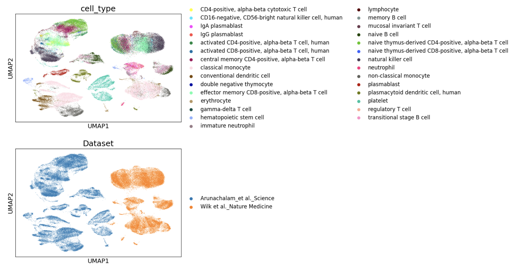
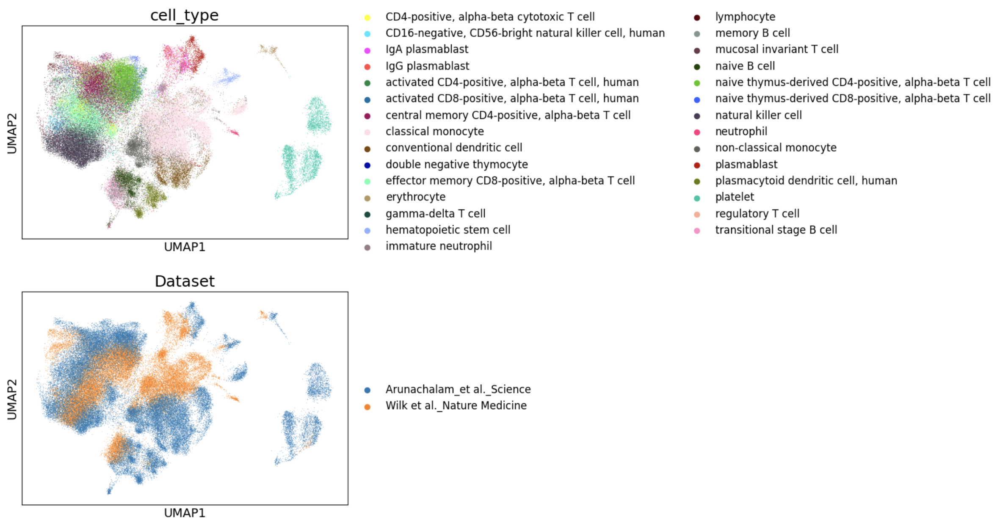
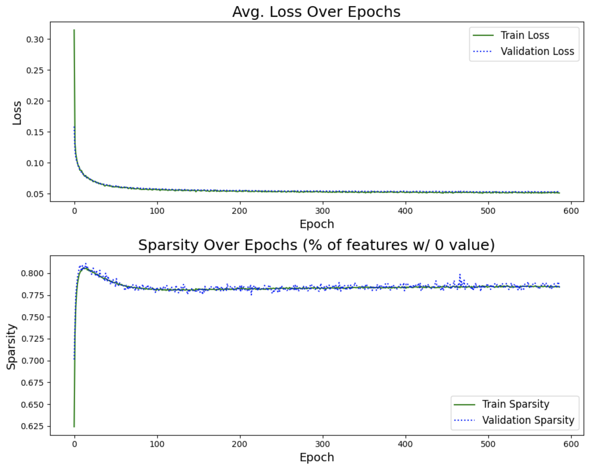
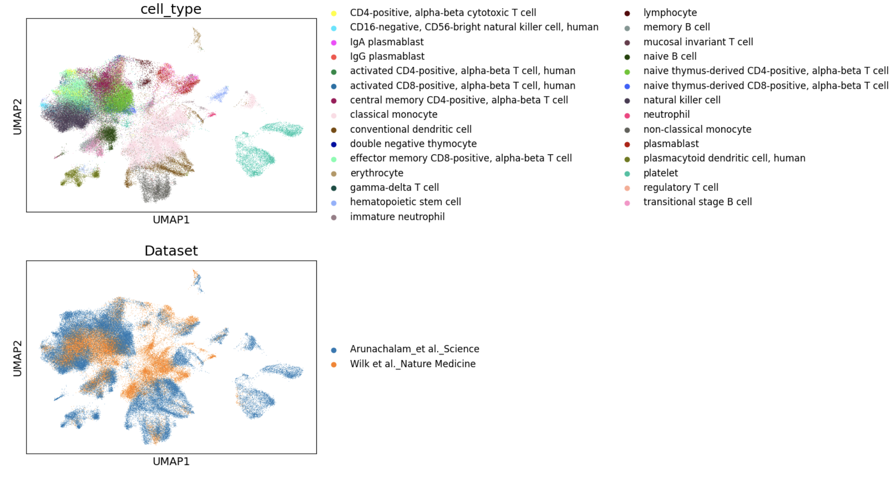

# sparseSC

This project explores how [sparse autoencoders](https://arxiv.org/abs/2309.08600) can be leveraged to extract interpretable features from learned representations of [single-cell data](https://www.nature.com/articles/s41596-020-00409-w). This project is inspired by Anthropic's publication [Towards Monosemanticity: Decomposing Language Models With Dictionary Learning](https://transformer-circuits.pub/2023/monosemantic-features/index.html#feature-analysis).

## Background and Key Terms

- **Transcriptomic methods** measure the differential [RNA](https://en.wikipedia.org/wiki/RNA) expression transcribed from [DNA](https://en.wikipedia.org/wiki/DNA). Within groups of cells with identical DNA, RNA expression levels can differ significantly across genes, driving distinguishable cell states.

- **Single-cell RNA-seq data** is a specific transcriptomic measurement of gene expression via RNA counts. Individual cells have their RNA sequenced, and the data is represented as a cell × gene counts matrix, where each cell is a vector of RNA gene counts.

- **Cell Types** are one of the most straightforward categorical labels differentiated by transcriptomic signals. For example, in a given sample of white blood cells, there might be [CD4 cells](https://en.wikipedia.org/wiki/CD4), which are characterized by their role in regulating the immune response, and [CD8 cells](https://en.wikipedia.org/wiki/Cytotoxic_T_cell), which directly attack invasive pathogens. For the purposes of this exploration, cell types are a useful categorical variable that characterizes true and verifiable biological signals.

## Problem

- **Biologically Uninterpretable Representations:** Many current single-cell RNA-seq models rely heavily on non-linear transformations, resulting in representations that are effective for downstream tasks (e.g., clustering, prediction tasks, dataset integration) but lack biological interpretability.

- **Polysemantic Representations:** By reducing the representation space, these models risk producing dimensions where multiple biological features are entangled, making it difficult to find independent axes of variation that describe biological "directions" (features).

## Proposition

- By combining the signal-extracting ability of deep learning models with sparse autoencoders, we aim to discover rich, interpretable, monosemantic axes of variation for these representations. These axes will allow us to better decode high-dimensional transcriptomic signals that underlie distinct biological states.

## Methods

### Dataset and Preparation

- Two related single-cell datasets, from Lee et al. and Arunachalam et al., were queried from [this data repository](https://cellxgene.cziscience.com/collections/b9fc3d70-5a72-4479-a046-c2cc1ab19efc).
- Both datasets are from peripheral blood samples from patients with and without COVID-19.
- Since the studies were conducted separately, the technical signal between experiments overwhelms the interesting biological signal. These are called batch effects.
- Basic preprocessing standard to the domain was conducted.

  
   
  <em>Figure 1: Preprocessed UMAP of the RNA Gene Expression of the Combined Datasets</em>

### Dataset Integration and Representation Learning

- To align these datasets with their shared biological signals, we employ a standard implementation of [scVI](https://docs.scvi-tools.org/en/1.1.5/user_guide/models/scvi.html).
- scVI is a deep learning architecture that assumes a latent cell state representation `z` that is independent of technical variables such as batch or experiment.
- Crucially, we use scVI to learn a reduced representation of cells across both datasets that corrects for technical batch effects while maintaining biological signal. This takes the place of the final MLP layer used in Anthropic's method.
- Notebook is [here](./notebooks/datsets.ipynb)

  
   
  <em>Figure 2: UMAP of Latent scVI 'Dense' Representation</em>

### Learning a Sparse Representation with an Autoencoder

- A sparse autoencoder is built according to the general configuration specified in the [literature](https://transformer-circuits.pub/2023/monosemantic-features/index.html#appendix-autoencoder-dataset).
- Source code is [here](./src/sparse_autoencoder.py)
- Notebook is [here](./notebooks/modeling.ipynb)

  
   
  <em>Figure 3: Training Curves for Autoencoder</em>

  
   
  <em>Figure 4: UMAP of Hidden SAE 'Sparse' Representation</em>

## Results

- Univariate correlations between one-hot encoded cell type labels and both "dense" and "sparse" representations of the datasets were computed.
- Feature/cell pairs with extreme correlation for a single metadata category were identified as having strong singular correlations, suggesting monosemanticity.
- Significantly more features with strong singular correlation were found for the sparse representation than the dense one.
- Notebook is [here](./notebooks/analysis_1.ipynb)

## Discussion

- This limited exploration suggests that sparse autoencoders (SAEs) may be a promising tool for constructing meaningful biological features from complex datasets.
- The results are encouraging enough to warrant a more rigorous investigation. A more focused study could help determine whether the features with strong singular correlations are truly monosemantic.
- **Next Steps**:
  - Examine the pairwise correlations of strong singular features that correspond to the same biological category.
  - If these features are not highly correlated, it would suggest that, while they encode the same biological category, they might be capturing different but related biological phenomena.
  - Conversely, some features that encode different cell types may be extremely correlated, indicating polysemanticity.
